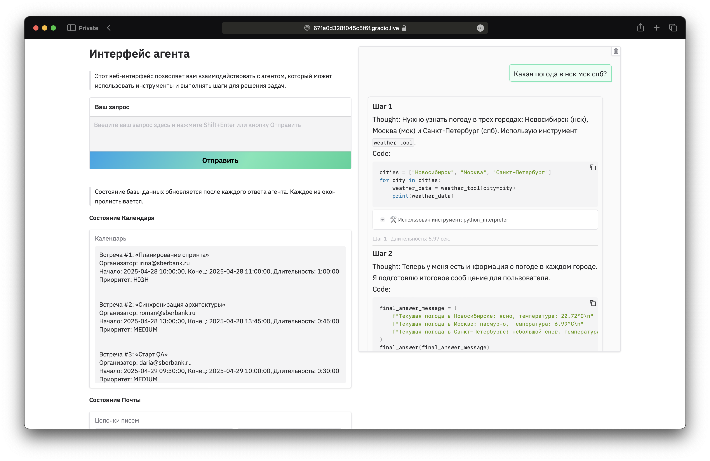

# Весенняя экономическая школа Сбера и Высшей школы экономики (2025)

Агент обладает следующими функционалом:

*   **Управление календарем (`calendar_tools.py`):**
    *   Работа с календарем (обавление, удаление и просмотр встреч).
*   **Работа с электронной почтой (`mail_tools.py`):**
    *   Просмотр и чтение почтового ящика.
    *   Суммаризация переписки с помощью LLM.
    *   Генерация ответа на последнее письмо в переписке с помощью LLM.
    *   Перевод треда на другие языки.
*   **Базовые утилиты (`basic_tools.py`):**
    *   Конвертация валют.
    *   Получение информации о погоде (текущей и прогноза).

## Установка
Необходимо установить библиотеки с файла requirements.txt
## Конфигурация и получение API ключений


*   **GigaChat:** Будет предоставлен индивидуально.
*   **Курсы валют:** Ключ от [exchangerate-api.com](https://www.exchangerate-api.com) необходимо получить на сайте (указывать номер карты не требуется).
*   **Погода:** Ключ от [OpenWeatherMap](https://openweathermap.org/api) необходимо получить на сайте (указывать номер карты не требуется).

Заполните файл `credentials.json` в корне проекта со следующим содержимым, заменив вставки на реальные значения:

```json
{
    "gigachat_authorization_key": "YOUR_GIGACHAT_KEY",
    "gigachat_client_id": "YOUR_GIGACHAT_CLIENT_ID",
    "currency_api_key": "YOUR_CURRENCY_API_KEY",
    "weather_api_key": "YOUR_WEATHER_API_KEY"
}
```

## Использование
Можно запускать в `agent.ipynb` через jupyter ноутбук 
```python
agent.run('Какая погода в спб, нск и москве?', reset=False)
```
Или использовать специальный интерфейс
```python
# hide_steps=True — скрывает шаги в интерфейсе, но выводит их ниже в jupyter notebook 
GradioUI(agent, mailbox, calendar, hide_steps=False).launch() 
```



